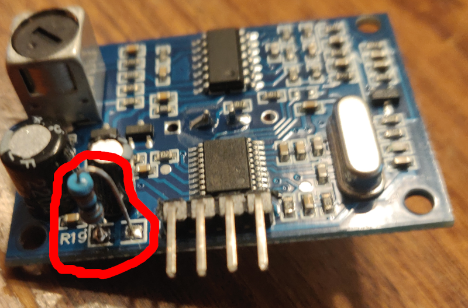
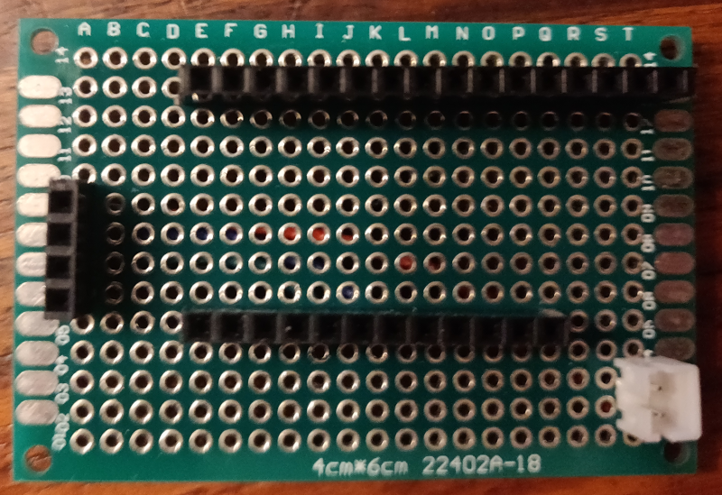
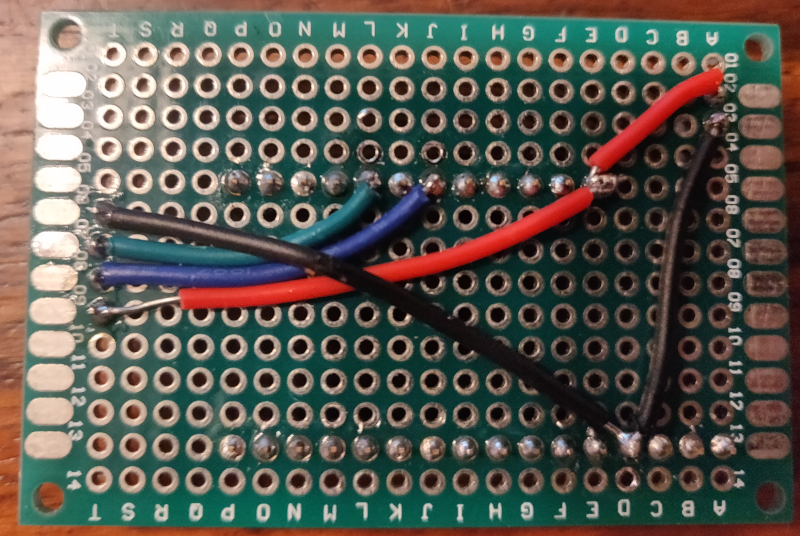
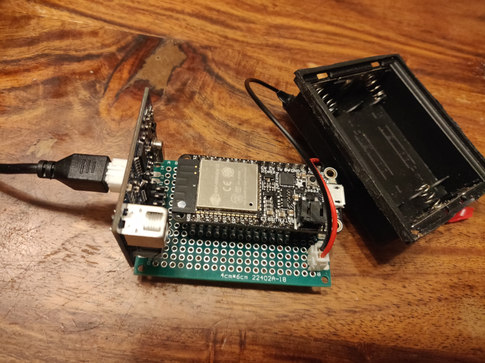
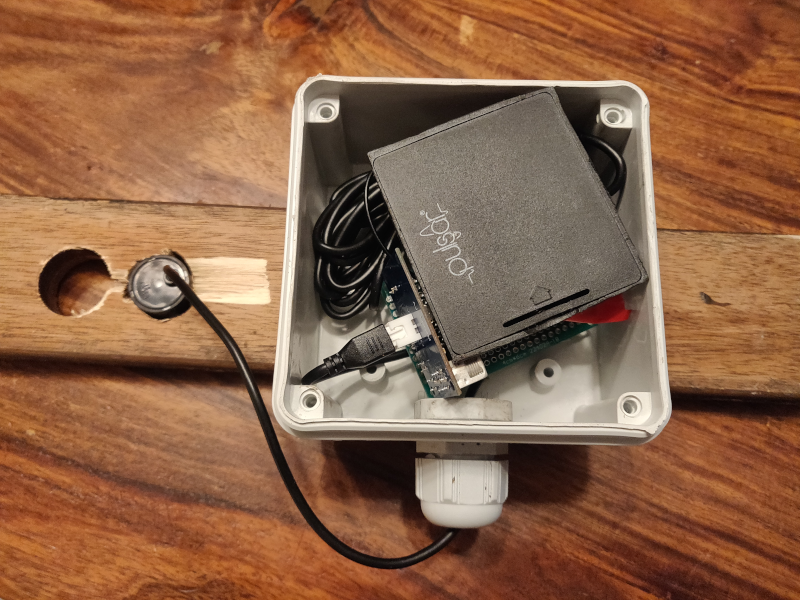
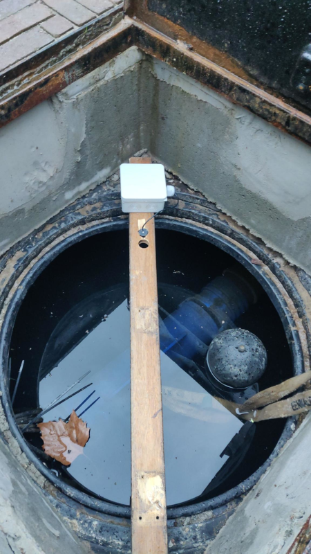

# Rainwater well level monitoring

I wanted to know when my rainwater well is empty and I've read about solutions using ultrasonic sound measurements. So I decided to create something like that for my rainwater well.

I chose an ESP32 and an AJ-SR04M waterproof ultrasonic module for this job which will measure the water level, publish it to an MQTT wich I can read out using Node-RED/Home Assistent and/or Zabbix.

The idea was to put a cable into the well so the monitoring device could be powered, and could send data using that cable. However, for now I failed to push a cable through the existing holding tube, so my current implementation is wireless using WiFi and 3 AA batteries. 

WiFi reception inside the well with the lid closed, seems to be a challenge; but it seems to work most of the time since I have an outdoor accesspoint close to the well.

The ESP32 will ask the AJ-SR04M module to measure the distance and read out the result. The result is a timing of how long it took for the ultrasonic sound to be sent and bounce back to the sensor. This is then converted to a distance in centimeters using the formula 

$$
d = { c \times t \over 2 }
$$

Where 
  * $d$ is distance in cm
  * $c$ is the speed of light in cm/µs
  * $t$ is the time it took for the sound to bounce back to the sensor in µs

which is then published to a MQTT using a WiFi connection. 

Since it runs on batteries I implemented powersaving functionality by using ESP32 deep sleep and by using the power-hungry wifi as less as possible:

The ESP32 will only take one measurement every set time and go in deep sleep in between measurements. It will only initialize WiFi and publish the measurement to MQTT if the measured distance differs from previous measurement.
But to be able to check if the device is still alive when the water level does nog change for some time it wil publish the measurement anyways on set times as a heartbeat.
If it was unable to establish a Wifi connection within a set timeout, the ESP32 will stop trying and go back to deep sleep. It will be retried next time it wakes.
And if a measured distance is outside pre-set boundaries, it is deemed invalid and the measuring will be retried for a pre set number of times

## Required hardware:

* ESP32 board 
  (an energy efficient one. I used an [Addafruit Feather Huzzah32](https://www.adafruit.com/product/3405) I had lying around, but a [DFRobot FireBeetle 2 ESP32-E](https://www.dfrobot.com/product-2195.html) is supposedly much more energy efficient.)
  Don't use a DOIT ESP32 DevKit, as I tried first, since those even won't be able to initialize Wifi on 3 AA batteries.
* AJ-SR04M waterproof ultrasonic sensor
* 300KΩ resistor
* 3 AA batteries
* battery holder for 3 AA batteries
* waterproof casing
* PH2.0 2pin male and female connector
* a 4x6cm prototype pcb
* Single row pcb header pins:
  * For the AJ-SR04M sensor module:
    * 1x 4 pins female
  * For the Adafruit HUZZAH32 (adjust if you use another ESP32 board):
    * 1x 12 pins female and male
    * 1x 16 pins female and male

## Required software:

  * PlatformIO or Arduino IDE
  * a functional MQTT (I used mosquitto) that is reachable for the ESP32 using WiFi

## Step 1: Change AJ-SR04M operating mode to powersave.
The AJ-SR04M sensor board features a "powersave" mode (<40uA sleep mode, 30mA working current). To enable this mode, you have to solder a 300KΩ resistor on pins R19 of the board.

This is of course only required if you are planning to use the module on batteries.

The difference in operation between normal mode and this powersave mode is that it will automatically go in low power mode after performing a measurement. In normal mode you can trigger a measurement by sending a high pulse of 10µs on the trigger pin. To trigger a measurement in powersave mode you need to keep the triggerpin high for 1ms to wake up the sensormodule. 

## Step 2: Create PCB for the project
Solder the pcb header pins and PH2.0 male connector on the prototype pcb so that:

  * PH2.0 positive pin -> HUZZAH32 BAT pin -> AJ-SR04M 5V pin
  * PH2.0 negative pin -> HUZZAH32 GND pin -> AJ-SR04M GND pin
  * HUZZAH32 pin 15 -> AJ-SR04M echo pin
  * HUZZAH32 pin 27 -> AJ-SR04M trig pin

 

## Step 3: Compile and upload code to ESP32
I have created this project in PlatformIO, but you should be able to use the Arduino IDE if you are more familiar with that. In that case you will have to install the PubSubClient library by hand using the Arduino IDE Library installer.

  * Git clone or download the source
  * Rename or copy include/settings.h.example to include/settings.h
  * Adjust settings to your needs (`TIME_TO_SLEEP`, `HEARTBEAT`, `SENSOR_TIMEOUT` and `WIFI_TIMEOUT` are defaults for when the device (re)boots but they can be adjusted during runtime by publishing alternative settings to `MQTT_SETTINGS_TOPIC`):
    * `TIME_TO_SLEEP` is the default time between measurements in seconds
    * `HEARTBEAT` is the default time between sending measurements even if it did not change
    * `SENSOR_RANGE_MIN` is the minimal distance the sensor is able to detect. If a lower value is received, it wil be invalidated.
    * `SENSOR_RANGE_MAX` is the maximal distance the sensor is able to detect. A higher value will be invalidated
    * `SENSOR_TIMEOUT` default number of measurement retries when measured distance is out of bounds
    * `WIFI_TIMEOUT` default maximum waiting time in seconds for a wifi connection to establish
    * `WIFI_SSID` Wifi SSID
    * `WIFI_PASSWORD` Wifi password
    * `MQTT_HOST` IP adress of MQTT server
    * `MQTT_PORT` Port of MQTT server 
    * `MQTT_PUBLISH_TOPIC` Topic on MQTT server to publish measured distance to
    * `MQTT_SETTINGS_TOPIC` Topic on MQTT server where adjustable program settings are published
  * In main.cpp: adjust `echoPin`, `trigPin` and `LED_BUILTIN` if you choose to connect the pins differently or if you chose to use another ESP32 board.
  * Compile and upload the code to the ESP32.

## Step 4: Put it all together en test

Do not yet use the batteries, but use a USB cable to your PC, so that you can monitor the console, to check if the device is able to correctly measure distance, to connect to your wifi, connect to your MQTT and is able to publish there.

If everything works, you should have a retained message on your MQTT's `MQTT_PUBLISH_TOPIC` topic. The program publishes the message in retained mode so you can always retrieve the last measured value.

The device will also check on `MQTT_SETTINGS_TOPIC` for updated settings, and apply them.

You can update:

  * `MQTT_SETTINGS_TOPIC`/heartbeat
  * `MQTT_SETTINGS_TOPIC`/time_to_sleep
  * `MQTT_SETTINGS_TOPIC`/wifi_timeout
  * `MQTT_SETTINGS_TOPIC`/sensor_timeout

by sending a **retained** value to those topics. Those settings will then be picked up by the device the next time that it wakes up and publishes a measurement.
To make sure the device received all settings before going back to sleep, it will also publish a boot sequence number to `MQTT_SETTINGS_TOPIC`/ping and wait for that message to come back. That ping message is not retained so to catch it you need an active client subscribed to it, but then that value can be used to check/know when the device is connected and how much wake/sleep cycles it has performed up until now.

## Step 5: Finalize
To finalize solder a female PH2.0 2p to the battery holder output, make sure USB is unplugged and connect the batteries.

Put everything in a waterproof casing and install it in your rainwater well making sure the sensor is placed at least 20cm above the maximum water level.
You will have to manually measure the distance from the sensor to the max. water level to know at what distance the well is 100% full. And again from the sensor to the min. water level to know at what distance the well is empty. Now you can use this formula to calculate how full the well is in percentage:
$$
{ d_{measurement} - d_{min} \over d_{max} - d_{min} } \times 100
$$

I've put the box on a plank that fits diagonally over my well, drilled a hole in it to fit the sensor in facing downwards.

